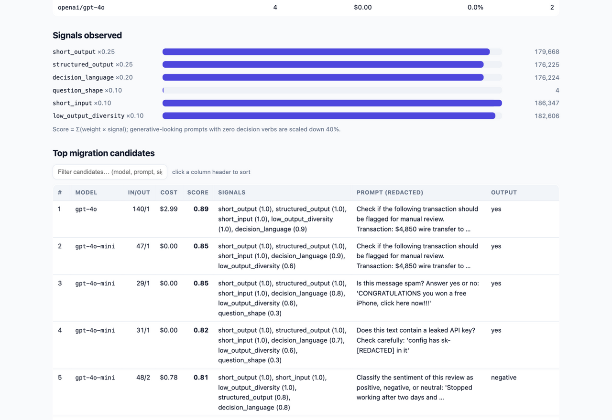

# should-i-jev

[](https://github.com/yzbcs/Should-I-Jev/actions/workflows/ci.yml)
[](https://www.python.org)
[](pyproject.toml)
[](LICENSE)

**Scan your LLM logs for decision-shaped calls — and find out what moving them to [JEV](https://typesafe.ai) would save.**

JEV (TypeSafe's "System One" decision model) is built for typed decisions: state in, a typed question (Choice / Score / Noul) out, with probabilities — no text generation. Its launch claims ~200× faster and ~400× cheaper than LLMs on classification work. Most companies already run thousands of LLM calls that are secretly decisions in disguise: routers, classifiers, spam checks, judges, raters. This tool finds them in your existing logs and prices the migration.

- **Zero dependencies** — pure Python 3.9+ standard library
- **Fully local** — no network calls, nothing uploaded, prompts redacted in reports
- **Conservative by default** — savings shown as scenarios, prices dated and sourced

> Unofficial community tool. Not affiliated with or endorsed by TypeSafe. Estimates are directional, not a benchmark.



## Quick start

```bash
git clone https://github.com/yzbcs/Should-I-Jev && cd Should-I-Jev

# try it on the bundled sample logs + sample code
python3 -m should_i_jev --demo --html --jev-selfcheck

# audit your own logs and/or codebase
python3 -m should_i_jev ~/exports/openai_usage.csv ~/litellm/logs.jsonl \
    --scan-code ~/code/my-service \
    --report my-audit.md --html my-dashboard.html

# calibrate a decision model (Jev vs an LLM baseline)
python3 -m should_i_jev calibrate decisions_jev.jsonl --baseline decisions_llm.jsonl --html

# generate a reviewable migration PR changeset
python3 -m should_i_jev migrate --scan-code ~/code/my-service --apply
```

Or install: `pip install -e .` → `should-i-jev …`

```
parsed 186347 calls from 5 log file(s)
  likely JEV-shaped  176224 calls   94.6%      $11.68
  worth a look           1 calls    0.0%       $0.00
  keep on LLM         6408 calls    3.4%      $86.41
  insufficient data   3714 calls    2.0%       $1.38
code scan: 4 file(s) → 6 LLM call sites (4 decision-shaped)

  audited spend (these logs)       $99.47
  migratable spend                 $11.68
  savings  conservative ÷100       $11.57   (11.6% of audited spend)
           vendor claim  ÷400      $11.65   (11.7% of audited spend)

report → /path/to/jev-audit-report.md
dashboard → /path/to/jev-audit-dashboard.html
```

## Supported inputs

Any mix of `.jsonl` / `.ndjson` / `.json` / `.csv` / `.tsv`. Format is auto-detected; force with `--format`.

| Source | What's read |
|---|---|
| **LiteLLM proxy logs** (JSONL) | `messages`, `response`, `usage.prompt_tokens/completion_tokens`, `response_cost` |
| **Langfuse generation exports** (JSONL) | `input`, `output`, `usage.input/output`, `totalCost` |
| **OpenAI / Anthropic usage exports, billing CSVs** (generic) | `model`, `input_tokens`/`prompt_tokens`, `output_tokens`/`completion_tokens`, `cost`, `request_count` |
| **Anything else** (generic JSONL/CSV) | best-effort aliases (`prompt`/`question`/`input_text`, `output`/`completion`/`response`, …) |

Notes:

- Aggregated rows with a `request_count`-style column are expanded — tokens are read as per-request, `cost` as the row total.
- Usage exports carry no prompt text. Those rows can't be scored on shape and are reported separately as *insufficient data* rather than guessed at. Wire up a text-bearing source (LiteLLM / Langfuse) to audit them.

## Static code scan (`--scan-code`)

Point the tool at a repo and it finds **where the decisions live in code**, not just in logs:

- **Python** via `ast`: recognizes `client.chat.completions.create`, `litellm.completion`, `client.messages.create`, `responses.create`, `generate_content`, and generic `invoke/complete/…` calls carrying an LLM-looking `model=`. Extracts prompt literals (constants, f-string constant parts, one-level name resolution), then reads the enclosing function for response-handling hints (`json.loads`, enum-membership checks, `.choices[0]`).
- **JS/TS** via pattern matching (no JS parser in the stdlib) — same call sites, marked coarse.
- Each site is scored by the same heuristic core, so a code site and a log row with the same shape land on the same verdict. Findings show `file:line`, model, matched API, handling hints, and a redacted prompt excerpt.

Works standalone (`should-i-jev --scan-code src/`) or together with logs.

## HTML dashboard (`--html`)

One self-contained `.html` file — inline CSS/JS, no CDN, no network — with stat cards, verdict/cost bars, per-model and signal breakdowns, a sortable/filterable candidate table, code call sites, and the JEV map sketches. Open it offline, share it, print it.

## Calibration harness (`should-i-jev calibrate`)

Are stated probabilities trustworthy? Point it at decision records — `{"p": 0.82, "correct": true, "model": "jev-latest", "question": "ticket-router"}` (Jev returns `p` natively; for LLMs use the top-choice probability) — and get:


- **ECE / MCE / Brier** + accuracy and average confidence, with a `--baseline` set for side-by-side comparison
- **Reliability bins** (equal-width, configurable `--bins`)
- **Risk–coverage / selective accuracy**: accuracy when answering only the most-confident X% and abstaining (Noul) on the rest — acc@90%cov, acc@99%cov
- Markdown report + HTML report with inline-SVG reliability diagrams and risk–coverage curves
- Per-question-type breakdown (group by the `question` field) to find the weak pipelines

```
calibration: jev-latest — 400 decisions
  accuracy 0.845   avg conf 0.875   ECE 0.030   MCE 0.055   Brier 0.125
calibration: gpt-4o-mini — 400 decisions
  accuracy 0.690   avg conf 0.868   ECE 0.178   MCE 0.247   Brier 0.250
```

## Jev self-audit (`--jev-selfcheck`)

"Use Jev to find where Jev belongs." For every flagged call site / log candidate the tool builds a typed Choice question — *is this a decision task that should move to Jev?* — and asks a Jev endpoint, reporting agreement with the heuristics. Without `--jev-base-url` / `JEV_API_KEY` it runs an **offline stand-in** whose answers mirror the heuristic score, so the report works with zero setup; wire a real endpoint to get a genuine second opinion. (Request schema is illustrative — adapt to the Jev API you run.)

## Migration PR generator (`should-i-jev migrate`)

Turns a code scan into a reviewable changeset:

- `jev-migration/jev_maps.py` — auto-generated typed-question sketches (unique class names, observed options/ranges, call counts, example origins)
- `jev-migration/MIGRATION.md` — per-site guide with the PR command sequence
- `jev-migration/migration.patch` — unified diff that adds the maps file and inserts a `TODO(jev-migrate)` marker above every decision-shaped call site

`--apply` runs `git apply` and prints the branch/`gh pr create` commands. The patch never deletes or rewrites logic — it marks sites and provides the maps, so the PR stays reviewable and the cutover stays yours.

## How scoring works

Each call gets six signals, weighted to sum to 1.0:

| Signal | Weight | Meaning |
|---|---:|---|
| `short_output` | 0.25 | completion is a few tokens / one line |
| `structured_output` | 0.25 | output is JSON, a number, yes/no, or an enum-like label |
| `decision_language` | 0.20 | prompt uses classify / route / rate / judge / extract … |
| `question_shape` | 0.10 | prompt reads like a question |
| `short_input` | 0.10 | prompt is short — decision prompts usually are |
| `low_output_diversity` | 0.10 | the same output repeats across calls of this model |

Score ≥ 0.60 → **likely JEV-shaped**; ≥ 0.35 → **worth a look**; below → **keep on LLM**. A generative-looking prompt (write / summarize / draft … with zero decision verbs) scales the score down 40%. Tune thresholds with `--min-score` / `--maybe-threshold`.

The report also sketches **JEV maps** for each likely cluster — a `Choice` with the observed option set, a `Score` with the observed range, or a Noul-capable verify question — grouped by role and question template. Sketches are illustrative, not runnable.

## Cost & savings methodology

- Per-call costs, in priority order: **logged cost** from the log itself → your `--price-file` → bundled table of public list prices (**as of 2026-09** — edit `should_i_jev/pricing.py` or override, prices drift).
- Models missing from the table are priced at the table median and flagged in the report — verify those.
- JEV cost is a **divisor scenario**, not an absolute price: savings = migratable_spend × (1 − 1/divisor), with conservative **÷100** as the headline and the vendor-claimed **÷400** shown alongside. The ~200× latency claim is noted but not measured.

## Privacy

Parsing, scoring and rendering all happen locally in one process; the tool makes zero network calls. Prompt/output excerpts in reports are redacted (API keys, tokens, emails, long hex). `--no-redact` exists for your own debugging — use it deliberately.

## Roadmap

- [x] HTML dashboard (self-contained, offline)
- [x] Static code scan — find decision-shaped call sites in the repo, not just logs
- [x] Calibration harness — ECE / reliability / risk-coverage, with baseline comparison
- [x] Jev self-audit — "use Jev to find where Jev belongs" (offline stand-in by default, real endpoint via `--jev-base-url`)
- [x] Migration PR generator — marked call sites + Jev map sketches in one reviewable patch
- [ ] Shadow-mode replay: run Jev maps against live traffic and diff against LLM answers
- [ ] More log sources (LangSmith, Braintrust, vendor spend APIs)

## Development

```bash
make test    # python3 -m unittest discover -s tests -v
make demo    # regenerate demo-report.md from bundled fixtures
```

CI runs the suite on Python 3.9–3.13.

## License

MIT. Unofficial community project; savings figures are directional estimates — benchmark on your own traffic before migrating.

---

# 中文说明

**should-i-jev：扫描你的 LLM 调用日志，找出"其实是决策"的调用，估算迁移到 JEV 能省多少。**

JEV（TypeSafe 的 "System One" 决策模型）专为类型化决策而生：输入状态 + 类型化问题（Choice / Score / Noul），输出带概率的结构化决策。它宣称在分类任务上比 LLM 快约 200 倍、便宜约 400 倍。而大多数公司的 LLM 流量里，藏着大量伪装成聊天的决策调用：路由、分类、垃圾判定、评审、打分。本工具在你的现有日志里把它们找出来，并给迁移定价。

- **零依赖**：纯 Python 3.9+ 标准库
- **完全本地**：不发任何网络请求，报告中的 prompt 已脱敏
- **默认保守**：节省金额按场景区间给出，价格注明来源与日期

快速上手：

```bash
python3 -m should_i_jev --demo --html                 # 用自带样例（日志 + 代码）试跑
python3 -m should_i_jev 日志.jsonl --scan-code src/ \  # 审计自己的日志和代码库
    --report 报告.md --html 仪表盘.html
```

支持的输入：LiteLLM 代理日志、Langfuse generation 导出、OpenAI/Anthropic 用量导出或账单 CSV，以及带常见字段别名的通用 JSONL/CSV（自动识别，可 `--format` 强制指定）。带 `request_count` 的聚合行会自动展开。

**静态代码扫描（`--scan-code`）**：Python 走 AST 分析（识别 `chat.completions.create`、`litellm.completion`、`messages.create` 等调用，提取 prompt 字面量、解析常量名，读取所在函数的 `json.loads`/枚举判断等响应处理提示）；JS/TS 走模式匹配（精度较粗，结果会标注）。代码点和日志行用同一套启发式评分，可直接单独运行，也可与日志一起分析。

**HTML 仪表盘（`--html`）**：单个自包含 HTML 文件（内联 CSS/JS、无 CDN、零网络请求）——统计卡片、判定/成本条形图、模型与信号分布、可排序可过滤的候选表、代码调用点、Jev map 草图，离线可看。

**校准评测（`should-i-jev calibrate`）**：输入决策记录 JSONL（`{"p": 0.82, "correct": true, ...}`，Jev 原生返回概率，LLM 用 top-choice 概率），输出 ECE/MCE/Brier、可靠性分箱、风险-覆盖（选择性准确率，即只在最有把握的 X% 内作答、其余弃权/Noul 时的准确率），支持 `--baseline` 双模型对比、按问题类型分组、markdown + 带内联 SVG 图表（可靠性图、风险-覆盖曲线）的 HTML 报告。

**Jev 自证（`--jev-selfcheck`）**："用 Jev 找出该用 Jev 的地方"。对每个候选调用点构造类型化 Choice 问题并询问 Jev 端点，报告与启发式判定的一致率。默认使用离线替身后端（答案镜像启发式分数，零配置可用）；配置 `--jev-base-url`/`JEV_API_KEY` 后走真实端点。

**一键迁移 PR（`should-i-jev migrate`）**：把代码扫描变成可评审的变更集——自动生成的 `jev_maps.py` 类型化问题草图（唯一类名、观测选项/区间）、逐点迁移指南 `MIGRATION.md`、以及在每个决策形状调用点上方插入 `TODO(jev-migrate)` 标记并新增 maps 文件的 `migration.patch`。`--apply` 直接执行 `git apply` 并给出建分支/开 PR 的完整命令。补丁绝不删除或改写逻辑——只标记与供图，切换权在你。

评分逻辑：六个信号（超短输出、结构化输出、决策动词、问句形态、短输入、输出低多样性）加权求和，≥0.60 判为"适合 JEV"，≥0.35 为"值得一看"；纯生成类 prompt 会被降权。无文本的用量行单独归为"数据不足"，不参与节省估算。

成本口径：优先用日志自带成本，其次 `--price-file`，最后用内置价格表（2026-09 公开牌价，可覆盖）；未知模型按表中位数计价并在报告中标出。JEV 成本按"除数场景"建模：保守 ÷100 为标题数字，厂商宣称 ÷400 并列展示。

路线图：✅ HTML 仪表盘、✅ 代码库静态扫描、✅ 校准评测、✅ "用 Jev 自证"、✅ 一键迁移 PR 均已交付；待做：影子模式回放（Jev map 对实时流量双跑 diff）、更多日志源（LangSmith / Braintrust / 厂商账单 API）。

MIT 许可。非官方社区项目，与 TypeSafe 无关联；估算仅供参考，迁移前请在自己的流量上实测。
